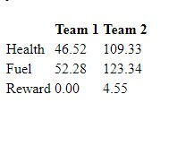
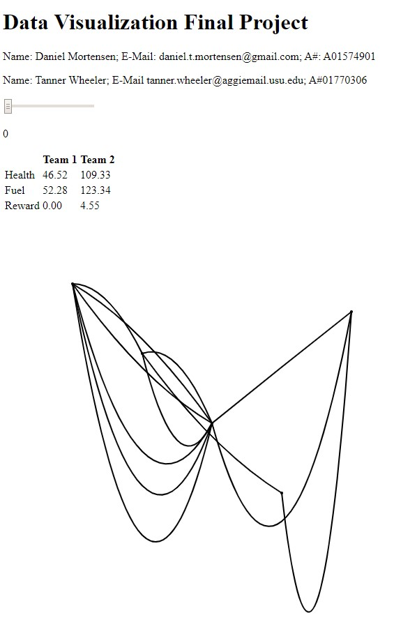

## Basic Info
### Multi-Agent Reinforcement Learning Visualization (MAR'V)

Contributers: 

Daniel Mortenson A01574901 daniel.t.mortensen@gmail.com

Tanner Wheeler A01770306 tanner.wheeler@aggiemail.usu.edu

Repository: [https://github.com/tannerwheeler/CS5890_project](https://github.com/tannerwheeler/CS5890_project)

## Background and Motivation
Synergy can be defined as an interaction or cooperation of two or more organizations, substances, or other agents to produce a combined effect greater than the sum or their separate efforts. Throughout human history, this principle has been shown to generate thoughts, creativity, and results that far surpass the collective cababilities of the individuals. Because working together has engendered many of the greatest acheivements to date, it is desired that this capability be extended to machine learning applications.

The data provided for this project is generated by a graph-based multi-agent reinforcement learning problem where individual agents are responsible for maximizing reward for both themselves as individuals, and for the team collectively.  The idea being that this concept of synergy and working together for the greater good be implemented in software such that individual entities maximize reward through coordinated efforts.  The learning aspect comes from tuning parameters in a model to achieve the desired behavior.  In this case, a policy function will be developed that takes the current entity and team state as input and returns an action. To make this effort a success, it will be important to gather insight into what causes the algorithm to learn and behave as it does which in the world of machine learning is perhaps the greatest challenge. To aid in this process, a comprehensive visualization is desired which will help the developer identify the algorithm's strengths and weaknesses, and gain insight into why the algorithm performs in the observed manner.

## Project Objectives
The purpose of this visulization is to decrease cognitive load when analyzing data from a multi-agent reinforcement learning algorithm. The simulator has been written in C++ and the proposed visualization will be constructed using Javascript and d3.  With the proposed design, the viewer will be able to visualize trends and behaviors that lead to team success. Some of these trends are based off of individual states such as health, fuel, position, etc. while others may have to do with global information such as strategic positioning of teammates.  All of these factors contribute to reward gain, or the forward progress the team makes towards accomplishing it's objective.  For further analysis, the viewer will also be able to see stats on each team at specific time steps during a simulation.  This will help the game designers and viewers gain necessary information towards understanding what is occuring during game play, specifically the underlying causes that indicate why a team wins while another loses.

## Data
The data for this visualization is comprised of individual agent states and rewards gathered during each simulation.  The simulation generates a binary file containing the aforementioned state data which can be read into Matlab and converted to a JSON format.  Each file will contain time stamps, individual state data, all pertinent global conditions, and reward gains.  The individual state data is comprised of health, mass, position, velocity, and fuel which, in addition to reward gains, are recorded at each time stamp. The number of units as well as the graph structure for any given simulation can vary and are predefined by the user.  The game can be played with an arbitrary number of nodes ranging from smaller maps such as 10 nodes to something larger, perhaps on the order of 1000+.

## Data Processing
The data will be complete. Because the simulation provides the information needed there should not be any values that are missing or that need approximating.  From the data the overall stats for the team will be available. There will be a summary of health, fuel, mass, velocity, position, and reward data for each agent at each timestep. This data will be read into Matlab and converted into a JSON file. This will allow for easier parsing on the Javascript side and help the user easily travers the data.

## Visualization Design

The first idea is to create a link node graph with the different links as the paths the units of the simulation travel.  The nodes do not contain information except the places where links meet.  The information for each link can be represented by the color of the graph.  This is in a heat map style with the color representing the attribute of the given variable.  This could be the number of one team in a link compared with the other.  The different attributes represted in the heat map will be selected from the two tables.  If the user were to click on an attribute the given attribute values would be displayed on the links.  This can be seen in Figure 1.  Below the link node graph in Figure 1, there is line chart that will show the overall stats for the given attribute.  This can also be linked to specific links that the user can choose.

The second idea is similar to the first.  The difference comes in the stroke width of the each link.  This allows the user to see one more attribute.  This can be the amount difference between each group at the link.  This also allows the user to see the main stream paths for the units throughout the graph.  At the bottom of Figure 2 the line graph is replaced with the stacked area chart.  The comparisons that come from the area chart aren't as clear as the line chart because the spatial position is not on the same scale position.

The third idea is creating a pie chart for each link.  The pie chart will contain the display the percentage of the attribute for each team at the given node.  The stroke of the pie chart or even the link can still display which team contains the most units on the link.  The pie charts are not as easy to read as the heat map layout.  The pie charts can display which team is doing better at a specific node, but it does not give specific values for the attribute.  The pie chart can become a problem when it comes to scaling the number of links in the graph.  If there are thousands of links in the graph then the pie charts will be overlapping each other and unviewable.  This same problem can come from using a bar chart at the bottom of Figure 3 instead of an stacked area chart or line chart.  The bar charts for each time stamp can be scaled to fit the page, but the amount of time stamps can make the bars thin and hard to read.

Our design will incorporate a few of the different aspects from each figure.  From all three figures we will have the two tables showing the general stats of each team at a given time stamp.  The time stamp stats can be controlled by the slider at the top of the each Figure.  The attribute can controlled by pressing the attributes in the table.  The figures above show the Reward attribute having been chosen.

 

For the link node graph, the graph will initially be the graph in Figure 1.  This will contain the heat map of the data.  The links will be colored depending on the value of the attribute.  The heat map needs to occur this way because the game paths are not necessarily 2D.

This will be used initially to show the distribution of the team and the values of each attribute.  Creating the heat map for each attribute is an essential part for this visualization.  The viewer needs to be able to see the values of each attribute distributed throughout the graph to see trends or important links that teams use throughout simulations.  The stroke widths will be added to this graph if we have enough time and the scalability of the graph allows for the widths to be seen clearly.

Two line charts at the bottom of the viualization will be used to compare different attributes and the other team.  Trends will also be more clear with spatial positioning of each value at each time stamp.  The yellow bar will show where the current time stamp is located in comparison to the full line chart.

## Must-Have Features
We need to have a way to view the attributes of the game using a heat map given a specific time.  Looking at one specific time it essential to reading this data.  The overall stats at the given time stamp also need to be implemented.  The line chart at the bottom must also be visible to the the user to see trends of what occurs during each simulation.  Viewing what attributes leads to team success is one of the main objectives of this visualization.  If they heat map and overal trend of the data is not implemented then the cognitive load needed to accomplish this objective will increase.

The user needs to also be able to choose which attribute they wish to view.  If they can only look at one attribute then finding which attribute helps in the simulation is rendered meaning less with this vis.  The user needs to be able to click on a specific attribute to see the heat map and its line chart representation.

## Optional Features

The slider for each time stamp is a very useful tool when comparing different times throughout a simulation.  Though this is an important feature it is not a Must-Have.  If the slider is unavailable the data can still be rendered at one specific time.  The user would only need to view different data groups.  The availability of the slider also changes the line chart.  If there is not a slider to change the time stamp then the yellow bar to show the current time is not needed.

The stroke width for the links is also an optional feature.  This is only useful if it does not clutter the graph.  If the graph is unreadable because the lines intersect too much then the graph is useless.

First an overview of all the data is necessary.  A overview of each link is an optional feature to be added.  If a user were to click on a link then they could see the attribute values for that specific link at the given time stamp on the line chart.  An overall view of the data is best in helping viewers see trends in the data.  A link specific overview can help viewers find larger trends in how each interaction affects the outcome.

Finally, brushing can be added to select a group of links in the node link graph to compare the change in attributes over time.  This will lead into further indepth analysis of each link.

## Project Schedule
| | Daniel| Tanner|
|-|-|-|
|Nov 11 - Nov 17|Convert Binary Data to JSON|Get greater understanding about the simulation data|
|Nov 18 - Nov 24|Create the node link map and table|Creat the node link map and table|
|Nov 25 - Dec 1|Create the overview line chart and time stamp slider|Creat the overview line chart and time stamp slider|
|Dec 1 - Dec 8|Make Final Changes/Present|Make Final Changes/Present|
|Dec 9 - Dec 15|Study for Finals/Final Project Evaluation|Study for Finals/Final Project Evaluation|

# Project Prototype

## Overview and Motivation

The data provided for this project is generated by a graph-based multi-agent reinforcement learning problem Daniel is working on for his Masters Degree.  This visualization is meant to help Daniel and others working with him to see the affects different attributes contribute to a team given different scenarios.  Particularly this visualization will help Daniel and his team understand different types of Reward functions to implement in order to maximize the reward through coordinated efforts given different starting attributes.

## Related Work

This visualization is using a node link diagram.  In class we discussed node link graphs and the pros and cons of their implementation.  From class Daniel and Tanner discussed the possiblity of using an adjacency matrix rather than a node link diagram because of the density of links overlapping.  This is a possible design flaw in the visualization.  

## Questions

Particularly this visualization will help Daniel and his team understand different types of Reward functions to implement in order to maximize the reward through coordinated efforts given different starting attributes.  This became the new focus of the visualization.  Originally the viz was going to just display the data gathered by the simulation, but it became apparent the viz can help understand different implementations at the same time.

## Data

The data was converted from a binary file to a json file using MATLAB.  The data is separated into three categories: graphData, itemData, and playerData.  The graphData contains the information of where the link starts, where it ends, and how long it is.  The itemData gives all of the attributes of each item for each time stamp of the simulation.  The playerData gives all of the attributes of each player for each time stamp of the simulation.

## Exploratory Data Analysis

The data helped show how the graph can be layed out and how dense the graph will be around the links.  The node link graph will need to be designed in a way that maximizes the space between each link.  The length of the path should not be the focus of the node link graph, but can be implemented in a position chart that can be an future part of the visualization after the essential parts are completed.  In the image above of the node link graph the distance of the links are random and an algorithm has not been implemented to maximize distances.

The information in the playerData and itemData does not give a clear value for the amount of maximum health the players can have throughout the game.  This creates a flaw in our design of using a bar graph to show the amount of health the team has overall.  This is because the team can have more health than any set value implemented in the visualization.  This changed the design in the tables for health to just being a numerical value than a bar chart.

## Design Evolution

The two main designs considered for map of the playing field were a node link graph and adjacency matrix.  The node link graph clearly allows the user to see the location of each node and the links that connect them through spatial positioning.  The adjacency matrix allows the user to see relationships of each link with large amounts of links in the map where the node link graph can become too crowded if there are too many links.  Currently the prototype has not deviated from the proposal and it is still using a node link diagram to visualize the map.

## Implementation

Interaction has not be implemented in this stage of the process.  However, the sliding input will be able to choose the time stamp of the data.  This will update the table, the node link graph, and the time series graph.  Once these have been updated cells of the table can be selected to view different time series graphs for different attributes.  (The time series graphs have been implemented, but are not pictured in the image below. It shows the overal values for each team for the whole simulation and how they change overtime.)

## Evaluation

By creating this visualization prototype Tanner was able to understand the data and what Daniel and his team are trying to analyze.  The questions of what implementations of the reward function has not be answered at this stage.  The data changes with the information, but the can be improved as interaction and styling is implemented.